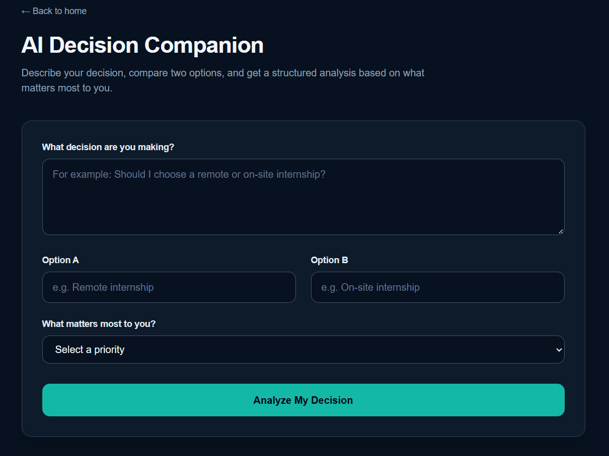

# AI Decision Companion

An AI-powered decision-support web application that helps users compare two options based on what matters most to them. The application uses Google Gemini to generate a structured analysis containing a recommendation, strengths, weaknesses, trade-offs, risks, considerations, and a suggested next step.

## Live Application

**Production URL:**  
https://ai-decision-companion.vercel.app/

## GitHub Repository

**Repository:**  
https://github.com/ushna-k/AI-Decision-Companion

---

## Project Brief

AI Decision Companion is a small AI-enhanced frontend application designed to help users think through difficult choices in a structured way. Users describe a decision, provide two options, and select their main priority. The application sends this information to an AI model and presents the response in a structured format covering the recommendation, strengths, weaknesses, trade-offs, risks, and next steps. I chose this idea because decision-making is a common real-world problem and it provides a meaningful use case for AI beyond a traditional chatbot.

---

## Screenshots

### Decision Form

Add a screenshot of the main Decision Companion form here.

```md

```

---

## Features

- Describe a decision in your own words
- Compare two different options
- Select the priority that matters most
- Generate an AI-powered decision analysis
- Receive a structured recommendation
- View strengths and weaknesses for both options
- Understand important trade-offs
- Identify potential risks
- Review factors that should be considered
- Get a suggested next step
- Validation for incomplete form submissions
- Input limits to reduce unnecessary or abusive API requests
- User-friendly error states when the AI service is unavailable
- Responsive interface for different screen sizes
- Accessible form controls and semantic structure
- Structured AI output using a schema
- Automated tests for important user flows

---

## How It Works

The application follows this flow:

1. The user opens the Decision Companion.
2. The user describes the decision they are trying to make.
3. The user enters Option A and Option B.
4. The user selects the most important priority.
5. The frontend validates the submitted information.
6. The frontend sends the decision data to the application's API route.
7. The API route validates the request again on the server.
8. The API route sends the information to the Google Gemini model.
9. Gemini generates a structured decision analysis.
10. The application displays the analysis to the user.
11. If the AI service is temporarily unavailable, the application displays an appropriate error message instead of silently failing.

---

## Tech Stack

### Frontend

- Next.js
- React
- TypeScript
- Tailwind CSS
- Semantic HTML

### AI

- Google Gemini API
- Vercel AI SDK
- Structured AI output
- Zod schema validation

### Testing

- Vitest
- React Testing Library
- jsdom
- `@testing-library/jest-dom`
- V8 coverage

### Development & Deployment

- Git
- GitHub
- Vercel
- Lighthouse
- axe DevTools

---

## Project Structure

```text
ai-decision-companion/
│
├── public/
│
├── src/
│   └── app/
│       ├── api/
│       │   └── analyze/
│       │       └── route.ts
│       │
│       └── decision/
│           ├── page.tsx
│           └── page.test.tsx
│
├── screenshots/
│
├── .env.local
├── .gitignore
├── package.json
├── package-lock.json
├── README.md
├── next.config.ts
├── tsconfig.json
└── ...
```

### Main Parts

#### `src/app/decision/page.tsx`

Contains the main Decision Companion interface.

It handles:

- Decision input
- Option inputs
- Priority selection
- Form validation
- Submitting the decision
- Loading state
- Error state
- Displaying the AI-generated analysis

#### `src/app/api/analyze/route.ts`

Server-side API route responsible for AI analysis.

It:

- Receives the submitted decision
- Validates the request
- Applies input limits
- Prevents identical options from being submitted
- Sends the information to Gemini
- Requests structured output
- Handles AI/API errors
- Returns the analysis to the frontend

#### `src/app/decision/page.test.tsx`

Contains automated tests for the Decision Companion interface and important user interactions.

---

# AI Integration

The main AI capability of this project is structured decision analysis.

Instead of using AI as a general-purpose chatbot, the application gives the model a specific decision-support task.

The user provides:

- The decision they are making
- Option A
- Option B
- Their most important priority

The AI uses this information to produce a structured analysis.

## AI Output

The generated response contains:

- Decision summary
- Recommendation
- Strengths of Option A
- Weaknesses of Option A
- Strengths of Option B
- Weaknesses of Option B
- Important trade-offs
- Potential risks
- Things to consider
- Suggested next step

This makes the AI capability directly connected to the purpose of the application rather than simply adding a chatbot to the interface.

## Model

The application uses Google Gemini through the Google Generative AI integration.

The model is configured in the server-side API route.

The API key is stored as an environment variable and is not exposed to the frontend.

```text
GOOGLE_GENERATIVE_AI_API_KEY
```

## Structured AI Output

The application uses structured output rather than relying on an unrestricted block of generated text.

The expected response follows a defined Zod schema so that the frontend knows which sections of the analysis it should display.

This provides more predictable output and makes the AI response easier to render and maintain.

The structured response includes fields for:

- Summary
- Recommendation
- Strengths
- Weaknesses
- Trade-offs
- Risks
- Considerations
- Suggested next step

## AI Prompt Design

The AI system instructions are designed specifically for decision support.

The model is instructed to:

- Compare both options fairly
- Consider the user's stated priority
- Avoid automatically favoring one option
- Avoid inventing information
- Acknowledge uncertainty when information is missing
- Identify trade-offs and risks
- Suggest a practical next step
- Avoid presenting its recommendation as guaranteed or universally correct
- Leave the final decision to the user

This keeps the AI focused on structured analysis rather than generic conversational responses.

---

# How AI Tools Were Used During Development

AI coding tools were used as development assistants throughout this project rather than as a replacement for testing or verification.

ChatGPT was used to help understand implementation concepts, troubleshoot errors, review code structure, plan development tasks, and work through issues involving Next.js, the Vercel AI SDK, structured AI output, testing, accessibility, and deployment.

AI assistance was also used while developing and debugging the application with coding tools such as Cursor and GitHub-based development workflows.

The development workflow involved reviewing AI-generated suggestions, applying appropriate changes to the project, running the application, testing the behavior, and correcting issues when the result did not work as expected.

AI tools also helped with debugging and development decisions, but the final implementation was verified through:

- Manual testing
- Automated tests
- Lighthouse audits
- axe accessibility testing
- Production deployment checks
- Git version control

The application itself uses Google Gemini as the end-user AI capability. This is separate from the AI coding tools used during development.

---

# Security & Request Protection

The Gemini API key is stored in `.env.local` during local development and configured as an environment variable in Vercel.

The API key is not exposed to the frontend and should never be committed to GitHub.

## Request Protection

The AI API route includes input limits to reduce unnecessary or abusive requests:

| Field | Maximum length |
|---|---:|
| Decision | 1000 characters |
| Option A | 500 characters |
| Option B | 500 characters |
| Priority | 100 characters |

The API route also uses a 30-second `maxDuration` to prevent requests from running indefinitely.

Automatic AI retries are disabled with:

```ts
maxRetries: 0
```

This prevents temporary AI failures from automatically triggering repeated requests.

These measures provide basic protection against trivial API-credit abuse while keeping the application simple.

---

# Error Handling & Resilience

AI services can fail because of temporary service availability, API limits, network problems, or other external issues.

The application therefore includes error handling around the AI request.

For example, when the Gemini service is temporarily unavailable, the application displays a user-friendly message such as:

> The AI service is temporarily busy. Please wait a moment and try again.

Instead of exposing technical API errors to the user, the frontend presents a simpler error state.

The application also handles invalid form submissions before sending unnecessary requests to the AI service.

## Examples of Handled Situations

- Empty decision
- Missing Option A
- Missing Option B
- Missing priority
- Decision that is too long
- Options that are too long
- Priority that is too long
- Identical Option A and Option B
- AI service temporarily unavailable
- Failed analysis request

---

# Accessibility

Accessibility was considered during the development of the application.

The interface uses:

- Semantic HTML elements
- Labels associated with form controls
- Keyboard-accessible form controls
- Clear form structure
- Visible focus states
- Accessible buttons
- Readable text
- Responsive layout
- Clear error messaging

## Lighthouse Accessibility Score

**100 / 100**

No accessibility issues were reported by the Lighthouse accessibility audit used during development.

## Accessibility Audit Improvement

During development, axe DevTools identified insufficient color contrast for the small disclaimer text.

The original contrast ratio was **4.23:1**, below the required **4.5:1** for the text size.

The text color was changed from:

```text
text-slate-500
```

to:

```text
text-slate-400
```

The accessibility audit was then run again and reported:

**0 issues**

This provided a concrete audit-driven accessibility improvement rather than relying only on manual inspection.

---

# Performance

The application was tested using Chrome Lighthouse.

The latest local Lighthouse audit produced the following results:

| Category | Score |
|---|---:|
| Performance | 96 |
| Accessibility | 100 |
| Best Practices | 100 |
| SEO | 100 |

The performance score improved during development after reviewing Lighthouse diagnostics and optimizing the application.

## Performance Considerations

The application keeps the interface relatively small and focused. It avoids unnecessary visual complexity and uses the Next.js application structure to handle rendering and routing.

Lighthouse development-mode measurements can be affected by development tooling and JavaScript processing. Performance measurements should therefore be considered most representative when testing the production build.

---

# Testing

Automated tests were added using Vitest and React Testing Library.

The tests focus on important user-facing behavior rather than implementation details.

## Current Test Results

```text
Test Files   1 passed (1)
Tests        3 passed (3)
```

The test suite currently covers:

### 1. Form Validation

Checks that validation errors appear when the user submits the form without providing the required information.

### 2. Valid Submission

Checks that a valid decision can be submitted successfully.

### 3. AI Analysis Display

Checks that the AI Decision Analysis result is displayed after a successful analysis request.

## Coverage

The test suite was also run with Vitest's V8 coverage provider.

Overall coverage:

| Metric | Coverage |
|---|---:|
| Statements | 65.92% |
| Branches | 84% |
| Functions | 69.23% |
| Lines | 65.92% |

The overall coverage exceeds the project's 50% minimum requirement.

## Running Tests

Install dependencies:

```bash
npm install
```

Run the test suite:

```bash
npm test
```

To run Vitest directly:

```bash
npx vitest
```

To run tests with coverage:

```bash
npm run test -- --coverage
```

---

# Browser Compatibility

The production application was manually checked in:

- Google Chrome
- Mozilla Firefox
- Chrome mobile device emulation for responsive behavior

The main decision flow and interface were checked for loading, layout, form interaction, and error behavior.

The application was not directly tested in Safari or mobile Safari because the development environment used for this project was Windows.

Safari and mobile Safari compatibility should therefore be considered **unverified rather than claimed as tested**.

---

# Local Development

## Prerequisites

Make sure you have:

- Node.js installed
- npm installed
- A Google Gemini API key

## Installation

Clone the repository:

```bash
git clone https://github.com/ushna-k/AI-Decision-Companion.git
```

Move into the project directory:

```bash
cd AI-Decision-Companion
```

Install dependencies:

```bash
npm install
```

## Environment Variables

Create a file named:

```text
.env.local
```

Add your Gemini API key:

```text
GOOGLE_GENERATIVE_AI_API_KEY=your_api_key_here
```

Do not commit `.env.local` to GitHub.

## Start the Development Server

Run:

```bash
npm run dev
```

Then open:

```text
http://localhost:3000
```

The Decision Companion is available at:

```text
http://localhost:3000/decision
```

---

# Production Build

To create a production build:

```bash
npm run build
```

To start the production server:

```bash
npm run start
```

---

# Deployment

The application is deployed using Vercel.

## Deployment Steps

1. Push the project to GitHub.
2. Import the repository into Vercel.
3. Configure the required environment variable:

```text
GOOGLE_GENERATIVE_AI_API_KEY
```

4. Deploy the application.
5. Open the production URL.
6. Test the Decision Companion.
7. Verify that AI analysis works in production.

## Production Verification

The deployed application was verified through the production URL.

The following were checked:

- Production URL accessible
- Main decision flow works
- AI integration connected
- Production environment variable configured
- Form validation works
- AI failure state works
- Chrome browser verification completed
- Firefox browser verification completed
- Responsive behavior checked using Chrome mobile emulation

---

# Deployment Checklist

## Application

- Application builds successfully
- Main decision flow works
- AI analysis is integrated
- Form validation is implemented
- Error handling is implemented
- Responsive layout is implemented

## AI

- Gemini API integration implemented
- API key stored using environment variables
- Structured AI output implemented
- AI failure state implemented
- Input length limits implemented
- AI request timeout configured with `maxDuration`
- Automatic AI retries disabled

## Testing

- Vitest configured
- React Testing Library configured
- Automated tests added
- 3 automated tests passing
- Overall test coverage: 65.92%

## Accessibility

- Lighthouse accessibility audit completed
- Accessibility score: 100
- axe DevTools audit completed
- axe reported 0 issues after the contrast improvement
- Form controls have labels
- Keyboard interaction considered
- Responsive layout considered

## Performance

- Lighthouse audit completed
- Performance score: 96
- Best Practices score: 100
- SEO score: 100

## Deployment

- Production URL verified
- Production AI flow tested
- Production environment variable verified
- Final deployment checked
- Chrome verification completed
- Firefox verification completed
- Mobile responsive behavior checked using Chrome device emulation

---

# Safe Failure & Recovery

The application does not assume that the AI service will always be available.

If an AI request fails, the application displays an error state instead of presenting an incomplete or misleading analysis.

Temporary AI service problems are communicated clearly to the user.

For example, a Gemini 503/high-demand response is converted into a user-friendly message rather than exposing the raw provider error.

The API also logs unexpected server-side analysis errors for debugging purposes.

---

# Rollback Plan

If a production deployment introduces a problem:

1. Identify the problematic deployment in Vercel.
2. Revert to the previous working deployment or redeploy the last known working commit from GitHub.
3. Verify the production URL.
4. Test the decision analysis flow again.

Git provides the project history needed to return to a known working version.

This rollback procedure was planned as part of the deployment process but was **not exercised during development**.

---

# Monitoring

The project does not currently use a dedicated external monitoring service.

Vercel deployment and runtime logs are used as the primary operational signal.

The server-side API route logs unexpected AI analysis errors, while user-facing error states prevent raw API errors from being exposed in the interface.

A future production version could add dedicated error monitoring and analytics.

---

# Known Limitations

- The quality of the analysis depends on the information provided by the user and the AI model's response.
- AI-generated recommendations may contain errors, assumptions, or incomplete information.
- AI-generated guidance should not be treated as guaranteed or professional advice.
- Gemini availability can temporarily affect the ability to generate an analysis.
- AI API usage may be subject to provider limits or quotas.
- The application does not make decisions on behalf of the user; it provides structured decision support.
- The application currently compares two options rather than supporting an unlimited number of alternatives.
- Safari and mobile Safari were not directly tested in the Windows development environment.
- Lighthouse development-mode results can be affected by development tooling and should be validated against the production build.

---

# Future Improvements

Possible future improvements include:

- Allowing users to compare more than two options
- Adding decision history
- Allowing users to save and revisit previous analyses
- Adding weighted criteria for more personalized comparisons
- Adding authentication for saved decisions
- Improving AI fallback behavior
- Adding more automated end-to-end tests
- Adding dedicated monitoring and analytics for production errors
- Further optimizing the production JavaScript bundle
- Adding export functionality for decision reports

---

# Design Decisions

The application intentionally focuses on one clear task instead of trying to become a general AI assistant.

The goal is to make the AI capability useful while keeping the interface simple.

The decision form collects only the information needed for the analysis:

- What decision are you making?
- What are the two options?
- What matters most to you?

This keeps the user flow short and reduces unnecessary interaction.

The result is then organized into sections so users can scan the analysis instead of reading one large block of AI-generated text.

---

# Reflection

Building AI Decision Companion helped me understand that integrating an AI model into an application involves more than simply sending a prompt and displaying the response.

One of the more challenging parts was making the AI response predictable enough for a real interface. A free-form AI response can change its structure, so using structured output made it easier to design a reliable result interface.

Another challenge was handling failures from an external AI service. The model may be temporarily unavailable or experience high demand, so the application needs to communicate those failures clearly instead of leaving the user wondering whether their request worked.

Testing also changed how I approached the application. Rather than only checking the application manually, I added automated tests for validation and the main analysis flow. This provided more confidence that important user interactions continued to work after changes.

The Lighthouse and axe audits were also useful parts of the process. They showed that a small application can achieve strong accessibility and performance scores while still having specific issues that can be improved. The final local Lighthouse audit achieved 96 Performance, 100 Accessibility, 100 Best Practices, and 100 SEO. Axe DevTools also helped identify and resolve a contrast issue.

The biggest lesson from this project was that a production-ready application is not just about getting the main feature to work. It also requires validation, error handling, testing, accessibility, performance checks, documentation, and a plan for what happens when something goes wrong.

---

# Disclaimer

AI Decision Companion is a decision-support tool.

AI-generated analysis may contain errors, assumptions, or incomplete information. Users should consider the analysis as one input into their decision-making process and remain responsible for their final decisions.

